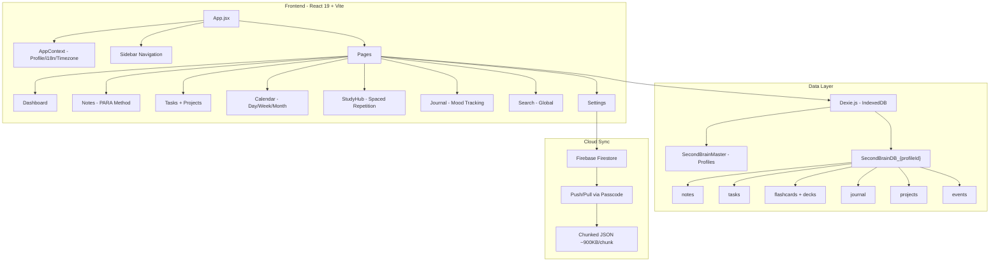
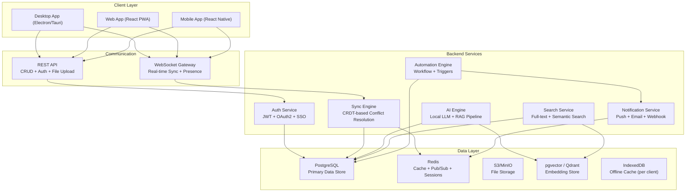
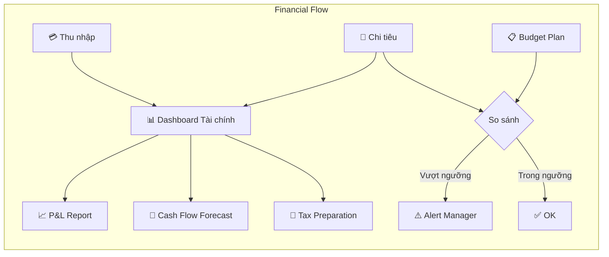
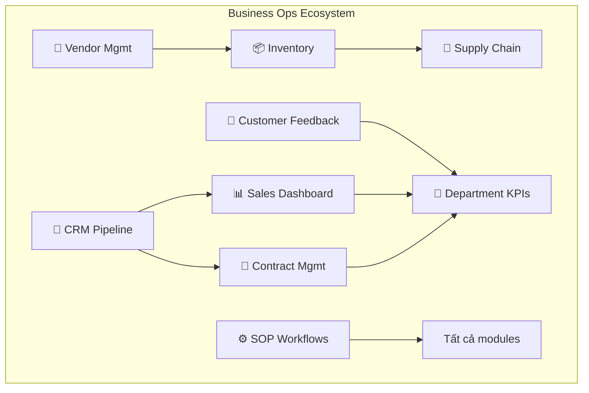
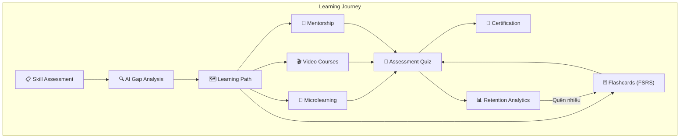
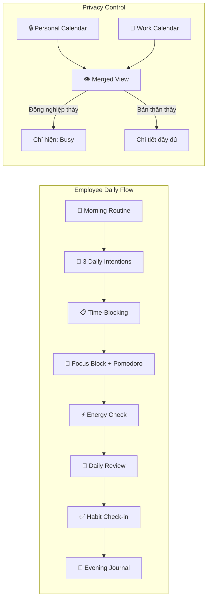
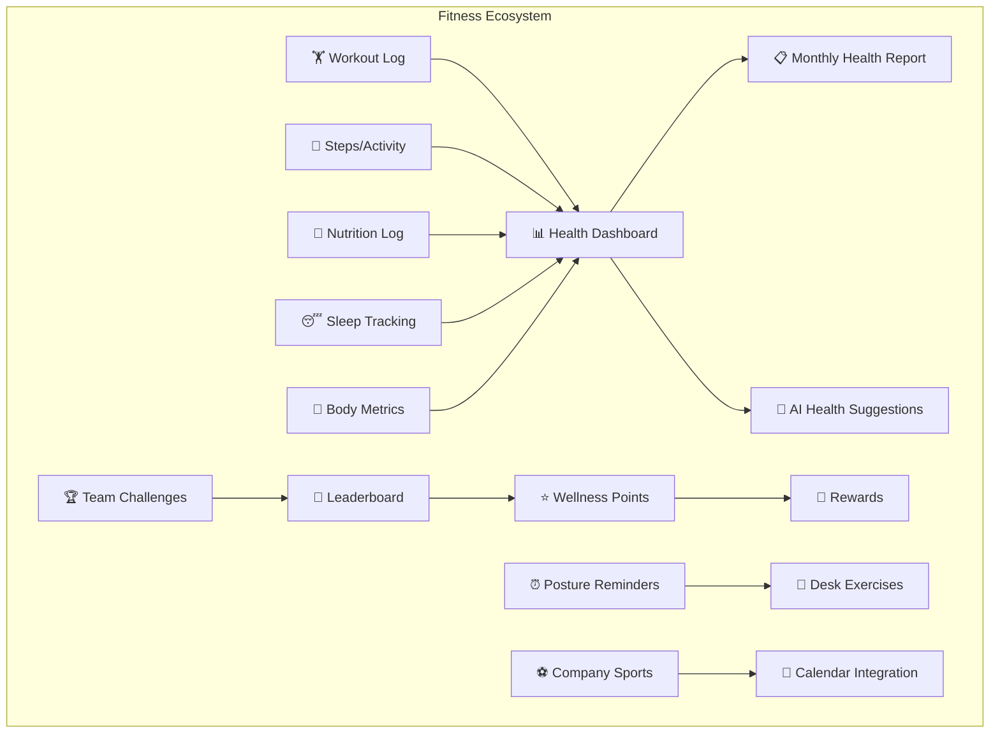
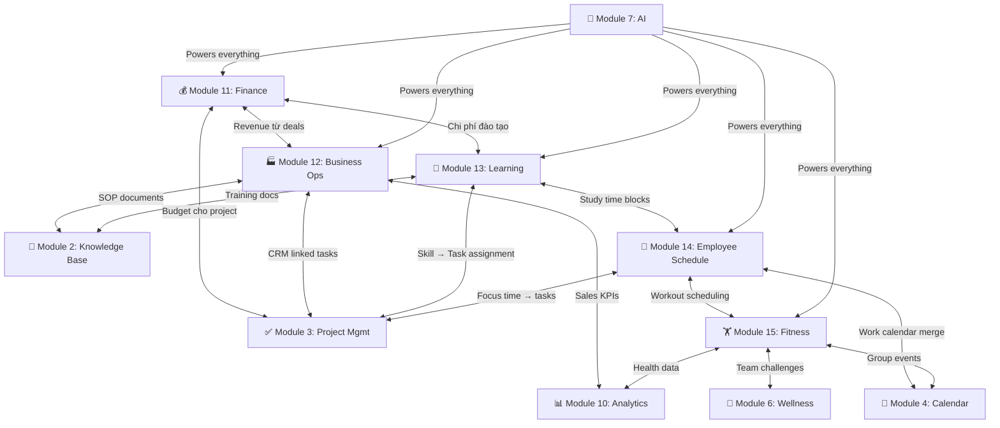
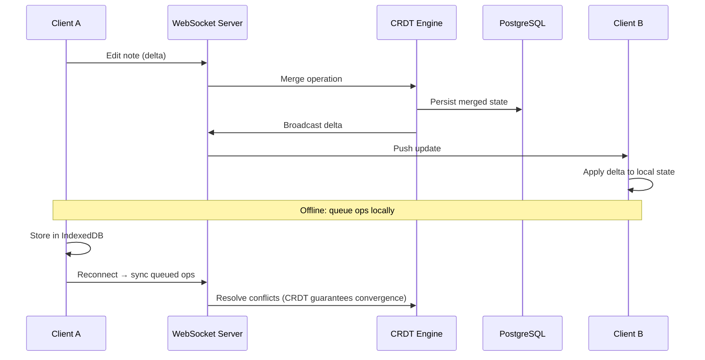
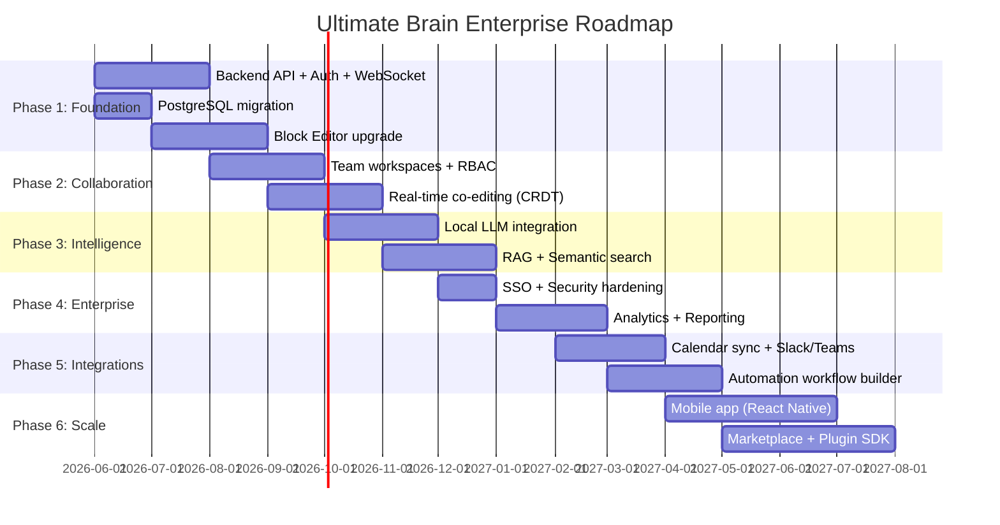

# 🧠 Ultimate Brain — Phân Tích & Tầm Nhìn Sản Phẩm Doanh Nghiệp

## Phần 1: Phân Tích Hiện Trạng "Second Brain"

### 1.1 Kiến Trúc Hiện Tại

### 1.2 Điểm Mạnh

| Khía cạnh | Chi tiết |
|---|---|
| **Local-first** | Dexie/IndexedDB → tốc độ cực nhanh, hoạt động offline 100% |
| **Multi-profile** | Cách ly dữ liệu hoàn toàn giữa các profile (DB riêng biệt) |
| **PARA Method** | Notes phân loại theo Projects/Areas/Resources/Archive |
| **Spaced Repetition** | SM-2 algorithm đầy đủ (interval, ease, repetitions) |
| **i18n** | Song ngữ Việt-Anh, timezone-aware |
| **Cloud Sync** | Push/Pull manual qua Firebase với chunking |
| **UI/UX** | Dark theme glassmorphism, Inter font, gradient accents |
| **Markdown** | Notes hỗ trợ Markdown với live preview |

### 1.3 Hạn Chế Cần Khắc Phục Cho Enterprise

| Hạn chế | Tác động |
|---|---|
| **Không có Authentication** | Passcode plaintext, không mã hóa, không RBAC |
| **Không Real-time Sync** | Chỉ manual push/pull, không WebSocket |
| **Không có Team/Org** | Chỉ hỗ trợ cá nhân, không chia sẻ workspace |
| **Calendar chưa hoàn thiện** | Week/Month view là placeholder |
| **Không có API layer** | Không có backend server, không extensible |
| **Search đơn giản** | Full-scan filter, không full-text search index |
| **Không có Automation** | Không workflow, không reminder, không integration |
| **Không có Analytics** | Không báo cáo năng suất, không insight |

---

## Phần 2: Tầm Nhìn "Ultimate Brain" — Enterprise Edition

### 2.1 Triết Lý Thiết Kế

> **"The Workspace Operating System"** — Không chỉ là app ghi chú, mà là hệ điều hành tri thức cho tổ chức. Local-first performance + Real-time collaboration + AI-powered intelligence.

### 2.2 Kiến Trúc Đề Xuất

---

### 2.3 Modules & Tính Năng Đẳng Cấp

---

#### 🏢 Module 1: Organization & Team Management

**Mục tiêu:** Biến Second Brain cá nhân thành nền tảng cho doanh nghiệp 5-500 người.

| Tính năng | Mô tả |
|---|---|
| **Multi-tenant Workspaces** | Mỗi tổ chức có workspace riêng, dữ liệu cách ly hoàn toàn |
| **Role-Based Access (RBAC)** | Owner → Admin → Manager → Member → Guest, phân quyền đến từng module |
| **Team Hierarchy** | Tạo Departments, Teams, Sub-teams — ánh xạ đúng cơ cấu tổ chức |
| **SSO Integration** | Đăng nhập qua Google Workspace, Microsoft 365, SAML/OIDC |
| **Audit Log** | Ghi lại mọi hành động: ai sửa gì, khi nào, ở đâu — compliance-ready |
| **Member Onboarding Flow** | Template workspace cho nhân viên mới, tự động gán projects/tasks |

---

#### 📝 Module 2: Advanced Knowledge Base (Notes 2.0)

**Nâng cấp từ:** Notes (PARA) hiện tại → Enterprise Knowledge Graph

| Tính năng | Mô tả |
|---|---|
| **Block-based Editor** | Giống Notion: heading, toggle, callout, table, embed, code block, kanban inline |
| **Bi-directional Links** | `[[Page Name]]` — liên kết 2 chiều tự động, xây dựng Knowledge Graph |
| **Knowledge Graph Visualization** | Bản đồ tri thức 3D/2D tương tác, nhìn thấy mối quan hệ giữa các notes |
| **Shared Wiki Spaces** | Workspace wiki cho team — SOPs, onboarding docs, internal policies |
| **Version History** | Diff view giữa các version, restore bất kỳ thời điểm nào |
| **Real-time Co-editing** | CRDT-based — nhiều người edit cùng lúc như Google Docs |
| **Templates Library** | Meeting notes, Sprint retrospective, 1-on-1, Decision log, RFC template |
| **Nested Databases** | Nhúng database vào trong note (như Notion databases) |

---

#### ✅ Module 3: Project & Task Management Pro

**Nâng cấp từ:** Tasks/Projects đơn giản → Full Project Management Suite

| Tính năng | Mô tả |
|---|---|
| **Multiple Views** | List / Kanban Board / Gantt Chart / Timeline / Table — cùng 1 dataset |
| **Task Dependencies** | Blocked-by, Blocks, Related-to — tự động cảnh báo bottleneck |
| **Subtasks & Checklists** | Nested subtasks vô hạn, progress tracking tự động |
| **Time Tracking** | Built-in timer, manual log, báo cáo giờ làm theo project/member |
| **Sprint/Milestone** | Agile workflow: Sprint planning, Backlog grooming, Velocity chart |
| **Assignee + Watchers** | Gán task cho team members, thông báo khi có cập nhật |
| **Custom Fields** | Tạo field tùy ý: dropdown, date, number, checkbox, URL, relation |
| **Automations** | "When status → Done, notify manager + move to Archive" |
| **Recurring Tasks** | Hàng ngày/tuần/tháng — tự động tạo instance mới |
| **Priority Matrix** | Eisenhower matrix visualization (Urgent/Important 2x2 grid) |

---

#### 📅 Module 4: Enterprise Calendar & Scheduling

**Nâng cấp từ:** Calendar (Day view only) → Full Scheduling Platform

| Tính năng | Mô tả |
|---|---|
| **Full Week/Month/Year Views** | Hoàn thiện 100% (hiện tại là placeholder) |
| **Team Calendar Overlay** | Xem lịch chồng lấp của nhiều thành viên — phát hiện conflict |
| **Booking/Scheduling Links** | Chia sẻ link để khách/đối tác tự book meeting (như Calendly) |
| **Resource Booking** | Đặt phòng họp, thiết bị, xe công ty — tránh trùng lặp |
| **Google/Outlook Sync** | 2-way sync với Google Calendar, Microsoft Outlook |
| **Smart Scheduling AI** | Tự đề xuất khung giờ tối ưu dựa trên workload + preference |
| **Time Zone Intelligence** | Hiển thị lịch theo timezone của từng thành viên remote |
| **Drag-and-Drop Rescheduling** | Kéo thả event giữa các ngày/giờ trực quan |

---

#### 🎓 Module 5: Corporate Learning Hub

**Nâng cấp từ:** StudyHub (Flashcards) → Enterprise Learning Management System

| Tính năng | Mô tả |
|---|---|
| **Learning Paths** | Tạo lộ trình học tập: Onboarding → Technical → Leadership |
| **Course Builder** | Admin tạo khóa học: Video + Quiz + Flashcard + Assignment |
| **Team Flashcard Decks** | Chia sẻ bộ thẻ giữa team — training vocabulary, compliance Q&A |
| **AI Card Generator** | Paste tài liệu → AI tự tạo flashcards (Q&A extraction) |
| **Progress Dashboard** | Manager xem tiến độ học tập của team: ai học gì, bao nhiêu % |
| **Certification Tracking** | Theo dõi chứng chỉ, ngày hết hạn, nhắc nhở gia hạn |
| **Spaced Repetition 2.0** | FSRS algorithm (thay SM-2) — chính xác hơn 35% |
| **Leaderboard & Gamification** | XP, Streak, Badge — tăng engagement học tập |

---

#### 📔 Module 6: Team Pulse & Wellness

**Nâng cấp từ:** Journal cá nhân → Employee Wellness & Pulse Survey

| Tính năng | Mô tả |
|---|---|
| **Daily Standup Bot** | Tự động hỏi "Hôm nay làm gì? Blocker gì?" mỗi sáng |
| **Anonymous Pulse Survey** | Team mood tracking ẩn danh — phát hiện burnout sớm |
| **Manager Dashboard** | Trend cảm xúc team theo tuần/tháng — không lộ danh tính cá nhân |
| **Gratitude Wall** | "Kudos" giữa đồng nghiệp — tăng team bonding |
| **Personal Journal (Private)** | Vẫn giữ nhật ký cá nhân 100% riêng tư |
| **AI Sentiment Analysis** | Phân tích sentiment từ journal entries, cảnh báo nếu trend tiêu cực |
| **Work-Life Balance Score** | Tính toán dựa trên giờ làm, meetings, break time |

---

#### 🤖 Module 7: AI Intelligence Layer

**Hoàn toàn mới — Đây là USP (Unique Selling Point) lớn nhất**

| Tính năng | Mô tả |
|---|---|
| **Local LLM Integration** | Chạy Llama/Mistral local qua Ollama — dữ liệu không rời máy |
| **RAG Pipeline** | AI đọc hiểu toàn bộ knowledge base → trả lời câu hỏi ngữ cảnh |
| **Smart Search** | "Tìm tất cả quyết định liên quan đến project X" — semantic search |
| **Auto-Summarize** | Tóm tắt meeting notes, dài → ngắn, tiếng Việt ↔ tiếng Anh |
| **AI Writing Assistant** | Viết email, báo cáo, proposal — trong context doanh nghiệp |
| **Task Auto-Prioritization** | AI đề xuất thứ tự ưu tiên dựa trên deadline, dependency, workload |
| **Knowledge Gap Detection** | "Bộ phận X chưa có SOP cho quy trình Y" — gợi ý tạo tài liệu |
| **Daily Digest** | AI tổng hợp: hôm nay cần làm gì, deadline nào sắp tới, ai cần follow-up |
| **Chat with Workspace** | Hỏi bằng ngôn ngữ tự nhiên: "Tuần này team hoàn thành bao nhiêu task?" |

---

#### 🔗 Module 8: Integration & Automation Platform

| Tính năng | Mô tả |
|---|---|
| **Webhook In/Out** | Nhận/gửi webhook từ/đến bất kỳ service nào |
| **API SDK** | REST + WebSocket API có tài liệu đầy đủ → third-party integration |
| **Zapier/n8n Compatible** | Connector cho automation platforms phổ biến |
| **Email-to-Note** | Forward email → tự động tạo note trong workspace |
| **Slack/Teams Bot** | Tạo task, check lịch, search knowledge base ngay trong chat |
| **GitHub/GitLab Integration** | Link commits/PRs với tasks, auto-update task status |
| **Custom Workflow Builder** | Drag-and-drop workflow: Trigger → Condition → Action |

---

#### 🔐 Module 9: Security & Compliance

| Tính năng | Mô tả |
|---|---|
| **End-to-End Encryption** | Dữ liệu mã hóa AES-256 tại client trước khi sync |
| **Zero-Knowledge Architecture** | Server không đọc được nội dung — chỉ user có key |
| **2FA/MFA** | TOTP, WebAuthn (passkey), SMS |
| **IP Whitelist** | Giới hạn truy cập từ IP công ty |
| **Data Residency** | Chọn vùng lưu trữ: Vietnam, Singapore, US, EU |
| **GDPR/PDPA Compliant** | Right to delete, data export, consent management |
| **Session Management** | Xem và revoke sessions từ các thiết bị |
| **Backup & Recovery** | Automated daily backup, point-in-time recovery |

---

#### 📊 Module 10: Analytics & Business Intelligence

| Tính năng | Mô tả |
|---|---|
| **Productivity Dashboard** | Tasks completed, velocity, burndown chart theo sprint |
| **Team Performance** | So sánh output giữa teams, identify bottlenecks |
| **Knowledge Base Analytics** | Trang nào được xem nhiều nhất? Gap ở đâu? |
| **Time Analysis** | Thời gian dành cho meeting vs deep work vs admin |
| **Custom Reports** | Drag-and-drop report builder, export PDF/Excel |
| **OKR/KPI Tracking** | Set Objectives → Key Results → Auto-calculate progress |
| **Real-time Widgets** | Embed dashboard vào bất kỳ note/page nào |

---

#### 💰 Module 11: Financial Management & Budgeting

**Hoàn toàn mới — Biến Ultimate Brain thành trung tâm quản lý tài chính doanh nghiệp**

| Tính năng | Mô tả |
|---|---|
| **Multi-Account Ledger** | Quản lý nhiều tài khoản ngân hàng, ví điện tử, tiền mặt — tổng hợp số dư real-time |
| **Expense Tracking** | Ghi nhận chi tiêu theo danh mục (nhân sự, vận hành, marketing, R&D), đính kèm hóa đơn/ảnh chụp |
| **Budget Planning** | Lập ngân sách theo tháng/quý/năm cho từng phòng ban, cảnh báo khi chi vượt ngưỡng |
| **Invoice & Billing** | Tạo hóa đơn chuyên nghiệp, gửi qua email, theo dõi trạng thái thanh toán (Paid/Pending/Overdue) |
| **Cash Flow Forecasting** | AI dự đoán dòng tiền 30/60/90 ngày dựa trên lịch sử thu chi + hợp đồng sắp đến hạn |
| **P&L Dashboard** | Báo cáo Lãi/Lỗ trực quan theo thời gian thực, drill-down đến từng khoản mục |
| **Expense Approval Workflow** | Nhân viên đề xuất chi → Manager duyệt → Kế toán thực hiện — audit trail đầy đủ |
| **Multi-Currency Support** | Hỗ trợ VND, USD, EUR, JPY — tự động quy đổi theo tỷ giá |
| **Revenue Tracking** | Theo dõi doanh thu theo sản phẩm/dịch vụ/khách hàng, so sánh target vs actual |
| **Tax Preparation** | Tổng hợp dữ liệu sẵn sàng cho khai thuế, export theo chuẩn kế toán VN |
| **Financial Reports** | Balance Sheet, Cash Flow Statement, Expense Report — export PDF/Excel tự động |
| **Recurring Transactions** | Tự động ghi nhận lương, tiền thuê, subscription hàng tháng |

---

#### 🏭 Module 12: Business Operations Command Center

**Hoàn toàn mới — Trung tâm điều hành kinh doanh toàn diện**

| Tính năng | Mô tả |
|---|---|
| **CRM Pipeline** | Quản lý khách hàng/deal theo Kanban: Lead → Qualified → Proposal → Negotiation → Won/Lost |
| **Contact Management** | Database khách hàng/đối tác/nhà cung cấp, lịch sử tương tác, ghi chú, tags |
| **Sales Dashboard** | Doanh số theo nhân viên/team/sản phẩm, conversion rate, average deal size |
| **Inventory Management** | Theo dõi tồn kho, cảnh báo hết hàng, lịch sử nhập/xuất, barcode/QR scan |
| **Contract Lifecycle** | Tạo → Đàm phán → Ký kết → Thực hiện → Hết hạn — nhắc gia hạn tự động |
| **Vendor Management** | Đánh giá nhà cung cấp, so sánh báo giá, theo dõi chất lượng/delivery |
| **SOP Workflow Automation** | Quy trình nghiệp vụ chuẩn hóa: Trigger → Steps → Approval → Complete |
| **Department KPI Board** | Mỗi phòng ban có bảng KPI riêng, tự động tính toán từ dữ liệu thực |
| **Meeting Room & Asset Booking** | Đặt phòng họp, xe công ty, thiết bị — calendar view tránh conflict |
| **Supply Chain Tracking** | Theo dõi đơn hàng từ đặt → vận chuyển → nhận hàng → kiểm tra chất lượng |
| **Customer Feedback Hub** | Thu thập phản hồi khách hàng, CSAT/NPS score, trend analysis |
| **Quotation Builder** | Tạo báo giá chuyên nghiệp từ product catalog, tự động tính thuế/chiết khấu |

---

#### 🧠 Module 13: Advanced Learning & Knowledge Academy

**Nâng cấp sâu từ:** StudyHub → Hệ sinh thái học tập & phát triển năng lực toàn diện

| Tính năng | Mô tả |
|---|---|
| **Microlearning Feeds** | Bài học ngắn 5-10 phút, phân phối hàng ngày qua notification — học trong giờ nghỉ |
| **Skill Matrix** | Bản đồ năng lực của tổ chức: mỗi nhân viên có skill profile, đánh giá level 1→5 |
| **AI Skill Gap Analysis** | AI so sánh skill hiện tại vs skill cần thiết cho vị trí → đề xuất lộ trình bổ sung |
| **Book Club / Reading List** | Tạo club đọc sách, chia sẻ tóm tắt, discuss highlights, track reading progress |
| **Video Learning Library** | Upload/embed video nội bộ (training, demo, onboarding), chèn quiz giữa video |
| **Mentorship Matching** | AI ghép mentor-mentee dựa trên skill gap + availability + compatibility |
| **Peer Knowledge Review** | Nhân viên tạo tài liệu → đồng nghiệp review + đánh giá chất lượng |
| **Certification Marketplace** | Danh sách chứng chỉ cần thiết theo vị trí, link đăng ký, theo dõi deadline |
| **Knowledge Retention Analytics** | Đo lường % kiến thức nhân viên nhớ được sau 7/30/90 ngày qua quiz |
| **Interactive Quizzes** | Tạo quiz đa dạng: multiple choice, fill-in, drag-and-drop, code exercise |
| **Learning Time Budget** | Mỗi nhân viên được X giờ/tuần cho học tập, manager approve & track |
| **External Course Integration** | Sync tiến độ từ Coursera, Udemy, LinkedIn Learning vào hệ thống |
| **AI Study Companion** | Chatbot trả lời câu hỏi về tài liệu nội bộ, giải thích concept, tạo practice test |
| **Knowledge Sharing Sessions** | Lên lịch buổi chia sẻ kiến thức nội bộ (Tech Talk, Brown Bag Lunch) — tự động tạo event + invite |

---

#### 📆 Module 14: Personal Employee Schedule & Life Planner

**Hoàn toàn mới — Lịch trình cá nhân nhân viên tách biệt khỏi lịch công ty**

> [!NOTE]
> Module này cho phép mỗi nhân viên có một "không gian cá nhân" trong hệ thống doanh nghiệp — quản lý cuộc sống cá nhân mà vẫn tích hợp mượt mà với lịch công việc.

| Tính năng | Mô tả |
|---|---|
| **Personal Calendar Layer** | Lịch cá nhân riêng tư (100% private), overlay với lịch công ty để xem free/busy |
| **Focus Time Blocks** | Đặt "Deep Work" blocks — tự động từ chối meeting request trong khung giờ này |
| **Pomodoro Timer** | Built-in Pomodoro (25/5 hoặc custom), thống kê số session/ngày, linked với task |
| **Daily Planner** | Kế hoạch ngày dạng time-blocking: kéo tasks vào khung giờ cụ thể |
| **Weekly Review Ritual** | Template review tuần: What went well? What didn't? What to improve? |
| **Habit Tracker** | Theo dõi thói quen hàng ngày: đọc sách, thiền, tập thể dục — streak & heatmap |
| **Goal Setting (Personal OKR)** | Mục tiêu cá nhân theo quý: "Học xong AWS cert", "Chạy 100km/tháng" |
| **Morning Routine Builder** | Thiết kế routine buổi sáng: wake up → exercise → meditation → plan → work |
| **Commute Planner** | Tính thời gian di chuyển, nhắc giờ khởi hành dựa trên traffic prediction |
| **Work-Personal Merge View** | Xem 2 lịch chồng lấp nhưng lịch cá nhân chỉ hiện "Busy" cho đồng nghiệp |
| **Energy Level Tracking** | Ghi nhận mức năng lượng theo khung giờ → AI đề xuất làm gì khi nào cho hiệu quả nhất |
| **Vacation & Leave Planner** | Lên kế hoạch nghỉ phép, tự động thông báo team, bàn giao tasks cho backup |
| **Birthday & Event Reminders** | Nhắc sinh nhật đồng nghiệp, anniversary, deadline chứng chỉ |
| **Daily Intention Setting** | Mỗi sáng set 3 "Must-Do" items — cuối ngày review hoàn thành hay chưa |

---

#### 🏋️ Module 15: Physical Fitness & Health Tracker

**Hoàn toàn mới — Chăm sóc sức khỏe thể chất nhân viên trong ecosystem doanh nghiệp**

> [!TIP]
> Nghiên cứu cho thấy nhân viên tập thể dục đều đặn có năng suất cao hơn 21% và ít nghỉ ốm hơn 27%. Module này giúp doanh nghiệp xây dựng văn hóa sức khỏe.

| Tính năng | Mô tả |
|---|---|
| **Workout Logger** | Ghi nhận buổi tập: loại bài tập, thời gian, cường độ, cảm nhận. Hỗ trợ Gym/Cardio/Yoga/Swimming/Team Sport |
| **Exercise Library** | Thư viện 200+ bài tập với hướng dẫn (text + hình minh họa), phân loại theo nhóm cơ |
| **Training Plan Builder** | Tạo kế hoạch tập luyện theo tuần: Push/Pull/Legs, Full Body, HIIT — có template sẵn |
| **Step & Activity Tracking** | Sync với Apple Health / Google Fit / Fitbit — đếm bước chân, calories, active minutes |
| **Team Fitness Challenges** | Thử thách team: "10,000 bước/ngày trong 30 ngày", "Plank Challenge", "Run 50km/tháng" — leaderboard |
| **Body Metrics Dashboard** | Theo dõi cân nặng, BMI, % mỡ, vòng eo — biểu đồ trend theo thời gian |
| **Nutrition Logger** | Ghi nhận bữa ăn, calories, macro (protein/carb/fat), nước uống — AI gợi ý cải thiện |
| **Posture & Ergonomic Reminders** | Nhắc đứng dậy mỗi 45 phút, bài tập giãn cơ 2 phút, chỉnh tư thế ngồi |
| **Company Sports Events** | Tổ chức giải đấu nội bộ: bóng đá, cầu lông, chạy bộ — đăng ký, bracket, kết quả |
| **Wellness Points System** | Tích điểm từ hoạt động thể chất → đổi thưởng (nghỉ phép thêm, voucher, quà) |
| **Sleep Quality Tracking** | Ghi nhận giờ ngủ/thức, chất lượng giấc ngủ — phân tích correlation với năng suất |
| **Stretching & Desk Exercise** | Video hướng dẫn bài tập tại bàn làm việc, reminder tự động giữa các Pomodoro |
| **Health Report Card** | Báo cáo sức khỏe tổng quan hàng tháng: activity level, stress score, sleep quality, nutrition |
| **Group Workout Scheduling** | Lên lịch tập nhóm (Yoga buổi trưa, Running Club sáng thứ 7), tích hợp vào Calendar |

---

### 2.35 Hệ Sinh Thái Liên Kết Giữa Các Module Mới

> [!IMPORTANT]
> Sức mạnh thực sự của Ultimate Brain nằm ở việc **tất cả 15 modules liên kết chéo** với nhau — không phải 15 ứng dụng rời rạc.

**Ví dụ Cross-module trong thực tế:**

| Kịch bản | Modules liên kết |
|---|---|
| Nhân viên đăng ký khóa học → chi phí tự ghi nhận vào budget đào tạo | Learning ↔ Finance |
| AI phát hiện team burnout (Wellness) → tự đề xuất giảm meeting (Calendar) + thêm break (Schedule) | Wellness ↔ Calendar ↔ Schedule |
| Deal thắng (CRM) → tự tạo project + tasks + budget allocation | Business Ops ↔ Project Mgmt ↔ Finance |
| Nhân viên set goal "chạy 50km" (Fitness) → liên kết với OKR cá nhân (Schedule) | Fitness ↔ Schedule |
| Tập thể dục buổi trưa (Fitness) → block lịch (Calendar) → Pomodoro break (Schedule) | Fitness ↔ Calendar ↔ Schedule |
| Quỹ team building (Finance) → tổ chức giải bóng đá (Fitness) → event trên Calendar | Finance ↔ Fitness ↔ Calendar |

### 2.4 Technical Architecture Deep Dive

#### Real-time Sync via WebSocket

#### Deployment Options

| Mode | Mô tả | Phù hợp |
|---|---|---|
| **☁️ Cloud SaaS** | Hosted trên cloud, multi-tenant | Startup, SME |
| **🏠 Self-hosted** | Docker Compose, chạy trên server nội bộ | Enterprise muốn kiểm soát data |
| **💻 Local-only** | Electron app, zero server, dữ liệu ở máy | Solo/Freelancer, bảo mật tối đa |
| **🔀 Hybrid** | Local-first + optional cloud sync | Team phân tán, kết nối không ổn định |

---

### 2.5 Roadmap Đề Xuất (6 Phases)

---

### 2.6 So Sánh Competitive Landscape (Mở rộng)

| Tính năng | Notion | Obsidian | ClickUp | Monday | SAP | **Ultimate Brain** |
|---|---|---|---|---|---|---|
| Local-first | ❌ | ✅ | ❌ | ❌ | ❌ | ✅ |
| Real-time collab | ✅ | ❌ | ✅ | ✅ | ✅ | ✅ |
| AI local (privacy) | ❌ | Plugin | ❌ | ❌ | ❌ | ✅ **(USP)** |
| Spaced Repetition | ❌ | Plugin | ❌ | ❌ | ❌ | ✅ Built-in |
| Project Management | Basic | ❌ | ✅ | ✅ | ✅ | ✅ |
| Financial Management | ❌ | ❌ | ❌ | ❌ | ✅ | ✅ **(USP)** |
| CRM/Business Ops | ❌ | ❌ | Basic | ✅ | ✅ | ✅ |
| Learning/Training | ❌ | ❌ | ❌ | ❌ | Plugin | ✅ **(USP)** |
| Employee Life Planner | ❌ | ❌ | ❌ | ❌ | ❌ | ✅ **(USP)** |
| Fitness & Health | ❌ | ❌ | ❌ | ❌ | ❌ | ✅ **(USP)** |
| Self-hosted option | ❌ | ✅ (vault) | ❌ | ❌ | On-prem | ✅ |
| Vietnamese-first | ❌ | ❌ | ❌ | ❌ | ❌ | ✅ **(USP)** |
| E2E Encryption | ❌ | Local | ❌ | ❌ | ✅ | ✅ |
| Knowledge Graph | ❌ | ✅ | ❌ | ❌ | ❌ | ✅ |
| Wellness/Pulse | ❌ | ❌ | ❌ | ❌ | ❌ | ✅ **(USP)** |
| **Tổng modules tích hợp** | 4 | 2 | 6 | 5 | 8+ | **15** |

---

### 2.7 Tech Stack Đề Xuất

| Layer | Technology | Lý do |
|---|---|---|
| **Frontend** | React 19 + Vite (giữ nguyên) | Tận dụng codebase hiện tại |
| **Desktop** | Tauri 2.0 | Nhẹ hơn Electron 10x, Rust backend |
| **Mobile** | React Native / Expo | Chia sẻ logic với web |
| **Backend** | Node.js + Fastify | Hiệu năng cao, WebSocket native |
| **Real-time** | WebSocket + Yjs (CRDT) | Proven cho collaborative editing |
| **Database** | PostgreSQL + pgvector | Relational + Vector search |
| **Cache** | Redis | Session, pub/sub, rate limiting |
| **Search** | Meilisearch | Full-text search, typo-tolerant, tự host |
| **AI** | Ollama + Llama 3.x | Local LLM, zero data leakage |
| **File Storage** | MinIO (S3-compatible) | Self-hosted, scalable |
| **Auth** | Lucia Auth + Arctic | Modern, type-safe, OAuth2 |
| **Deployment** | Docker Compose → Kubernetes | Từ đơn giản đến enterprise scale |

---

> [!IMPORTANT]
> **USP (Unique Selling Point) của Ultimate Brain so với mọi đối thủ:**
> 1. **Local-first + AI Private:** Dữ liệu không bao giờ rời khỏi server của doanh nghiệp, AI chạy local
> 2. **Vietnamese Enterprise Focus:** Thiết kế cho doanh nghiệp Việt Nam, UI/UX tiếng Việt bản địa, hỗ trợ kế toán/thuế VN
> 3. **All-in-one nhưng Self-hosted:** 15 modules trong 1 nền tảng, không phụ thuộc cloud nước ngoài
> 4. **Holistic Employee Care:** Không chỉ quản lý công việc mà còn chăm sóc sức khỏe thể chất + tinh thần + phát triển năng lực
> 5. **Financial + Business Ops tích hợp:** Duy nhất trên thị trường kết hợp Knowledge Management + CRM + Finance trong cùng 1 platform
> 6. **Work-Life Integration:** Employee Schedule & Life Planner với privacy controls — nhân viên quản lý cuộc sống cá nhân ngay trong hệ thống mà không lo lộ thông tin
